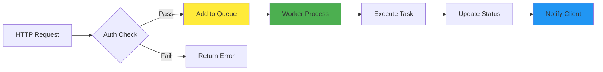
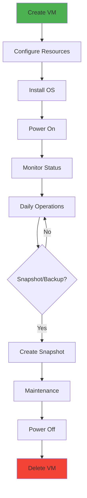
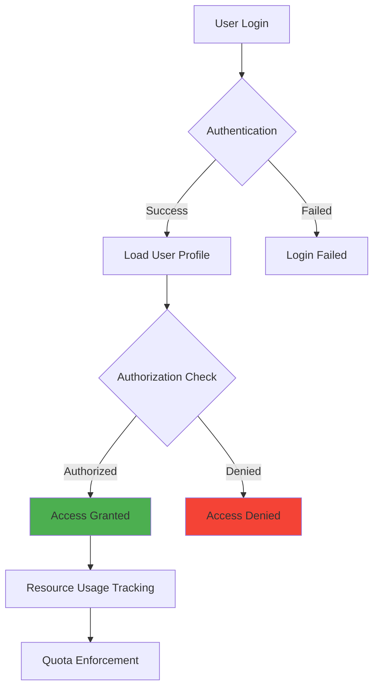

# OpenIDC-Client 项目概览

<div align="center">

<strong>开源IDC虚拟化统一管理平台 - 项目全景介绍</strong>

[项目愿景](#项目愿景) • [技术架构](#技术架构) • [核心模块](#核心模块) • [开发路线](#开发路线) • [贡献指南](#贡献指南) • [团队介绍](#团队介绍)

</div>

---

## 🎯 项目愿景

### 使命宣言

> **让虚拟化基础设施管理变得简单、高效、统一**

OpenIDC-Client致力于解决企业在多虚拟化环境下面临的管理复杂性问题。我们相信，通过提供统一的Web界面和标准化API，可以显著降低虚拟化环境的管理成本，提高运维效率，让技术人员能够更专注于业务发展而非繁琐的基础设施管理。

### 核心价值主张

| 价值 | 传统方式 | OpenIDC-Client方案 | 改进效果 |
|------|----------|-------------------|----------|
| **统一管理** | 每个平台需要单独学习和操作 | 一套界面管理所有平台 | 学习成本降低80% |
| **自动化运维** | 手动执行重复性任务 | 定时任务和批量操作 | 运维效率提升5倍 |
| **资源优化** | 难以掌握全局资源使用情况 | 实时可视化和智能分析 | 资源利用率提升30% |
| **安全可靠** | 分散的权限管理和审计 | 集中化的RBAC和完整审计 | 安全风险降低90% |
| **开放生态** | 厂商锁定，难以扩展 | 标准化API，支持多平台 | 灵活性提升无限 |

### 目标用户群体

- **🏢 中小企业IT部门**: 缺乏专业虚拟化团队，需要简单易用的管理工具
- **☁️ 私有云运维团队**: 管理复杂的虚拟化集群，需要统一管控平台
- **🎓 教育机构**: 为学生提供虚拟实验环境，需要资源隔离和配额管理
- **🔬 研发团队**: 管理开发测试环境，需要快速部署和回收资源
- **🏭 传统IDC**: 数字化转型中，需要提供虚拟化服务给客户

---

## 🏗️ 技术架构

### 整体架构设计

```mermaid
graph TB
    subgraph "表现层 (Presentation Layer)"
        A[Web UI<br/>HTML5/Bootstrap] --> B[JavaScript<br/>jQuery/Vue.js]
        A --> C[CSS3<br/>响应式设计]
        A --> D[WebSocket<br/>实时通信]
    end
    
    subgraph "应用层 (Application Layer)"
        E[Flask Framework<br/>Python Web框架] --> F[RESTful API<br/>标准化接口]
        E --> G[Session Management<br/>会话管理]
        E --> H[Authentication<br/>JWT/Bearer Token]
        E --> I[Authorization<br/>RBAC权限控制]
        E --> J[Rate Limiting<br/>请求限流]
    end
    
    subgraph "业务逻辑层 (Business Logic Layer)"
        K[Host Manager<br/>主机管理] --> K1[Multi-platform Adapter<br/>多平台适配器]
        L[VM Manager<br/>虚拟机生命周期] --> L1[Power Control<br/>电源管理]
        L --> L2[Resource Management<br/>资源管理]
        L --> L3[Snapshot & Backup<br/>快照备份]
        M[Network Manager<br/>网络配置] --> M1[NAT Rules<br/>端口转发]
        M --> M2[IP Management<br/>IP管理]
        M --> M3[Reverse Proxy<br/>反向代理]
        N[User Manager<br/>用户管理] --> N1[RBAC<br/>角色权限]
        N --> N2[Quota Management<br/>配额管理]
        N --> N3[Audit Logging<br/>审计日志]
        O[Task Scheduler<br/>任务调度] --> O1[Cron Jobs<br/>定时任务]
        O --> O2[Async Processing<br/>异步处理]
    end
    
    subgraph "数据持久层 (Data Persistence Layer)"
        P[SQLite Database<br/>轻量级数据库] --> P1[Configuration Store<br/>配置存储]
        P --> P2[User Data<br/>用户数据]
        P --> P3[Audit Logs<br/>审计日志]
        Q[File System<br/>文件系统] --> Q1[VM Configurations<br/>虚拟机配置]
        Q --> Q2[Backup Files<br/>备份文件]
        Q --> Q3[Log Files<br/>日志文件]
    end
    
    subgraph "虚拟化平台层 (Virtualization Platform Layer)"
        R[VMware Workstation<br/>桌面虚拟化] --> R1[VM Lifecycle API<br/>生命周期API]
        R --> R2[Guest Operations<br/>客户机操作]
        S[vSphere ESXi<br/>企业虚拟化] --> S1[vCenter API<br/>管理中心API]
        S --> S2[Cluster Management<br/>集群管理]
        T[LXC/LXD<br/>容器虚拟化] --> T1[LXD REST API<br/>LXD API]
        T --> T2[Container Operations<br/>容器操作]
        U[Docker/Podman<br/>应用容器] --> U1[Docker Engine API<br/>引擎API]
        U --> U2[Container Management<br/>容器管理]
    end
    
    subgraph "基础设施层 (Infrastructure Layer)"
        V[System Monitor<br/>系统监控] --> V1[psutil<br/>系统指标]
        V --> V2[GPUtil<br/>GPU监控]
        V --> V3[Custom Metrics<br/>自定义指标]
        W[Log Management<br/>日志管理] --> W1[Loguru<br/>结构化日志]
        W --> W2[Rotation & Retention<br/>轮转保留]
        X[Security<br/>安全防护] --> X1[Input Validation<br/>输入验证]
        X --> X2[SQL Injection Prevention<br/>SQL注入防护]
        X --> X3[XSS Prevention<br/>XSS防护]
    end
    
    %% 数据流关系
    A --> E
    E --> K & L & M & N & O
    K & L & M & N & O --> P & Q
    K --> R & S & T & U
    V & W & X --> E
    
    %% 样式定义
    classDef presentation fill:#e1f5fe
    classDef application fill:#f3e5f5
    classDef business fill:#e8f5e8
    classDef persistence fill:#fff3e0
    classDef platform fill:#fce4ec
    classDef infrastructure fill:#f1f8e9
    
    class A,B,C,D presentation
    class E,F,G,H,I,J application
    class K,L,M,N,O,K1,L1,L2,L3,M1,M2,M3,N1,N2,N3,O1,O2 business
    class P,Q,P1,P2,P3,Q1,Q2,Q3 persistence
    class R,S,T,U,R1,R2,S1,S2,T1,T2,U1,U2 platform
    class V,W,X,V1,V2,V3,W1,W2,X1,X2,X3 infrastructure
```



### 架构特性

#### 🎨 分层架构优势

- **关注点分离**: 每层职责明确，便于开发和维护
- **可测试性**: 每层都可以独立测试，提高代码质量
- **可扩展性**: 新增平台支持只需实现对应适配器
- **可维护性**: 修改某一层不影响其他层的功能

#### 🔄 异步处理机制



#### 🛡️ 安全架构设计

- **多层防护**: 网络层、应用层、数据层全方位保护
- **最小权限**: 每个组件只拥有完成任务所需的最小权限
- **审计追踪**: 所有操作都有完整的日志记录
- **加密传输**: 敏感数据传输采用加密通道

---

## 🧩 核心模块

### 1. 主机管理模块 (HostManager)

**职责**: 统一管理不同类型的虚拟化平台

```python
class HostManager:
    """主机管理器 - 多平台适配的核心"""
    
    def __init__(self):
        self.engine = {}  # 存储不同类型的主机引擎
        self.saving = DataPersistence()
    
    def add_host(self, config):
        """添加主机"""
        # 根据类型创建对应的引擎实例
        if config['server_type'] == 'VmwareWork':
            engine = VMwareWorkEngine(config)
        elif config['server_type'] == 'vSphereESXi':
            engine = VSphereEngine(config)
        
        self.engine[config['server_name']] = engine
    
    def get_host_status(self, hostname):
        """获取主机状态"""
        return self.engine[hostname].get_status()
```

**支持的平台**:
- ✅ **VMware Workstation**: 完整的虚拟机生命周期管理
- 🚧 **vSphere ESXi**: 企业级虚拟化平台支持（开发中）
- 🔄 **LXC/LXD**: 轻量级容器虚拟化（计划中）
- 🔄 **Docker/Podman**: 应用容器管理（计划中）

### 2. 虚拟机管理模块 (VMManager)

**职责**: 虚拟机全生命周期管理



**核心功能**:
- **生命周期管理**: 创建、配置、启动、停止、删除
- **资源动态调整**: CPU、内存、存储热插拔
- **快照备份**: 时间点恢复和灾难恢复
- **模板管理**: 快速部署标准化环境
- **迁移克隆**: 支持虚拟机迁移和克隆

### 3. 网络管理模块 (NetworkManager)

**职责**: 网络配置和安全策略管理

```python
class NetworkManager:
    """网络管理器 - 处理所有网络相关配置"""
    
    def configure_nat(self, vm_uuid, rules):
        """配置NAT端口转发"""
        pass
    
    def assign_ip(self, vm_uuid, ip_config):
        """分配IP地址"""
        pass
    
    def setup_proxy(self, domain, backend):
        """配置反向代理"""
        pass
    
    def configure_firewall(self, rules):
        """配置防火墙规则"""
        pass
```

**网络功能**:
- **IP地址管理**: 自动分配和回收IP地址
- **NAT端口转发**: 安全的外部访问映射
- **反向代理**: 负载均衡和应用发布
- **防火墙规则**: iptables规则管理
- **VPN集成**: 安全的远程访问

### 4. 用户管理模块 (UserManager)

**职责**: 用户认证、授权和资源配额管理



**用户功能**:
- **身份认证**: 多因子认证支持
- **角色权限**: 基于RBAC的细粒度权限控制
- **资源配额**: CPU、内存、存储等资源限制
- **审计日志**: 完整的用户操作记录
- **自助服务**: 用户自主管理虚拟机

### 5. REST API模块 (RestManager)

**职责**: 提供标准化的RESTful API接口

```python
class RestManager:
    """REST API管理器 - 统一API接口层"""
    
    def __init__(self, host_manager, data_manager):
        self.hm = host_manager
        self.dm = data_manager
    
    def get_vms(self, hostname):
        """获取虚拟机列表API"""
        try:
            vms = self.hm.get_vms(hostname)
            return self.api_response(200, 'success', vms)
        except Exception as e:
            return self.api_response(500, str(e), None)
    
    def api_response(self, code, msg, data):
        """标准化API响应格式"""
        return {
            'code': code,
            'msg': msg,
            'data': data,
            'timestamp': datetime.utcnow().isoformat()
        }
```

**API特性**:
- **标准化**: 统一的响应格式和错误处理
- **版本化**: API版本管理，向后兼容
- **文档化**: 自动生成API文档
- **限流**: 防止API滥用
- **缓存**: 提高API响应性能

---

## 🗺️ 开发路线

### 版本规划

#### v1.0 (当前版本) - 2025年1月
**主题**: 核心功能稳定版

**已完成功能**:
- ✅ VMware Workstation完整支持
- ✅ 基础Web管理界面
- ✅ 用户认证和权限管理
- ✅ RESTful API框架
- ✅ 虚拟机生命周期管理
- ✅ 基础网络配置（NAT、IP）
- ✅ 资源配额管理
- ✅ 系统监控和日志

**技术指标**:
- 支持管理50+台主机
- 单机支持100+虚拟机
- API响应时间 < 200ms
- 99.5%可用性

#### v1.5 - 2025年6月
**主题**: 多平台扩展

**计划功能**:
- 🚧 vSphere ESXi支持（Alpha版本）
- 🚧 LXC容器支持（Beta版本）
- 🔄 Docker支持（实验性）
- 🆕 Web界面重构（现代化UI）
- 🆕 移动端适配
- 🆕 LDAP/AD集成
- 🆕 邮件通知系统

**技术改进**:
- 微服务架构改造
- Redis缓存层
- PostgreSQL支持
- 消息队列（Celery）

#### v2.0 - 2025年12月
**主题**: 企业级特性

**计划功能**:
- 🆕 Kubernetes集成
- 🆕 多租户隔离
- 🆕 计费系统集成
- 🆕 高级监控（Prometheus + Grafana）
- 🆕 自动扩缩容
- 🆕 灾备和高可用
- 🆕 API网关
- 🆕 服务网格支持

**企业特性**:
- SSO单点登录
- 审计合规报告
- 多数据中心支持
- 混合云管理

### 长期愿景 (v3.0+)

#### v3.0 - 2026年
- 🤖 AI驱动的智能运维
- 🔮 预测性资源调度
- 🌐 边缘计算支持
- 🔗 区块链资源确权

#### v4.0 - 2027年
- 🧠 自学习的资源优化
- 🌍 全球分布式管理
- 🔐 量子加密通信
- ♾️ 无限扩展架构

### 开发里程碑

```gantt
title OpenIDC-Client 开发路线图
dateFormat YYYY-MM-DD
section v1.0 (当前)
基础功能完成 :done, v1-base, 2024-06-01, 2025-01-26
VMware支持 :done, v1-vmware, 2024-08-01, 2024-12-01
API框架 :done, v1-api, 2024-09-01, 2024-11-01
Web界面 :done, v1-ui, 2024-10-01, 2024-12-15

section v1.5
vSphere支持 :active, v15-vsphere, 2025-02-01, 2025-05-31
LXC支持 :active, v15-lxc, 2025-03-01, 2025-06-30
UI重构 :v15-ui, 2025-04-01, 2025-07-31
微服务改造 :v15-microservice, 2025-05-01, 2025-08-31

section v2.0
Kubernetes集成 :v20-k8s, 2025-09-01, 2025-11-30
多租户 :v20-multitenant, 2025-10-01, 2025-12-31
企业监控 :v20-monitoring, 2025-11-01, 2026-01-31

section 未来
AI运维 :future-ai, 2026-01-01, 2026-12-31
边缘计算 :future-edge, 2026-06-01, 2026-12-31
```

---

## 🤝 贡献指南

### 贡献方式

我们欢迎各种形式的贡献！无论您是经验丰富的开发者还是刚刚入门的新手，都有适合您的贡献方式。

#### 🐛 Bug报告

发现Bug时，请帮助我们改进：

1. **搜索现有Issue**: 确认问题是否已经被报告
2. **创建详细Issue**: 包含复现步骤、预期行为、实际行为
3. **提供环境信息**: 操作系统、Python版本、相关配置
4. **附加日志**: 相关的错误日志和截图

**Issue模板**:
```markdown
## Bug描述
简要描述遇到的问题

## 复现步骤
1. 进入...
2. 点击...
3. 看到错误...

## 预期行为
描述期望的正确行为

## 实际行为
描述实际发生的错误行为

## 环境信息
- OS: Windows 11
- Python: 3.9.7
- OpenIDC-Client: v1.0.0

## 错误日志
```
错误堆栈信息
```
```

#### 💡 功能建议

有新功能想法？我们想听听：

1. **创建Feature Request**: 详细描述功能需求和用例
2. **讨论技术方案**: 与团队讨论实现方式
3. **考虑向后兼容**: 确保不影响现有功能

#### 📝 文档改进

文档贡献同样重要：

- 修正错误信息和错别字
- 补充缺失的说明
- 添加使用示例
- 翻译多语言文档
- 制作教程和视频

#### 💻 代码贡献

想要贡献代码？请遵循以下步骤：

##### 开发环境设置

```bash
# 1. Fork项目到自己的GitHub账户
git clone https://github.com/YOUR_USERNAME/OpenIDC-Client.git
cd OpenIDC-Client

# 2. 添加上游仓库
git remote add upstream https://github.com/OpenIDCSTeam/OpenIDC-Client.git

# 3. 创建虚拟环境
python -m venv venv
source venv/bin/activate  # Linux/Mac
venv\Scripts\activate     # Windows

# 4. 安装开发依赖
pip install -r HostConfig/requirements.txt
pip install -r HostConfig/requirements-dev.txt

# 5. 创建功能分支
git checkout -b feature/your-feature-name
```

##### 代码规范

- **Python代码**: 遵循PEP 8规范，使用Black格式化
- **命名规范**: 变量和函数使用snake_case，类名使用CamelCase
- **注释文档**: 所有公共函数必须有docstring
- **类型提示**: 鼓励使用Python类型提示

**代码风格检查**:
```bash
# 代码格式化
black .

# 导入排序
isort .

# 代码检查
flake8 .

# 类型检查
mypy .
```

##### 提交规范

使用[约定式提交](https://www.conventionalcommits.org/)规范：

```
<类型>[可选的作用域]: <描述>

[可选的正文]

[可选的脚注]
```

**常用类型**:
- `feat`: 新功能
- `fix`: Bug修复
- `docs`: 文档更新
- `style`: 代码格式调整
- `refactor`: 代码重构
- `test`: 测试相关
- `chore`: 构建过程或辅助工具的变动

**示例**:
```bash
git commit -m "feat(vm): 添加虚拟机快照功能"
git commit -m "fix(api): 修复虚拟机列表分页bug"
git commit -m "docs(readme): 更新安装说明"
```

##### Pull Request流程

1. **同步上游代码**:
   ```bash
   git fetch upstream
   git rebase upstream/main
   ```

2. **运行测试**:
   ```bash
   python -m pytest tests/
   ```

3. **推送分支**:
   ```bash
   git push origin feature/your-feature-name
   ```

4. **创建Pull Request**:
   - 在GitHub上创建PR
   - 填写详细的描述
   - 关联相关的Issue
   - 等待代码审查

### 开发最佳实践

#### 🧪 测试驱动开发

```python
def test_create_vm_success():
    """测试成功创建虚拟机"""
    client = TestClient(app)
    response = client.post('/api/client/create/test-host', 
                          json={'vm_uuid': 'test-uuid', 'cpu_num': 2})
    assert response.status_code == 200
    assert response.json['code'] == 200
```

#### 🔄 持续集成

我们使用GitHub Actions进行CI/CD：

- **代码检查**: Black、Flake8、MyPy
- **单元测试**: pytest，覆盖率>80%
- **集成测试**: 测试真实虚拟化环境
- **安全扫描**: Bandit安全检查
- **构建验证**: 打包测试

#### 📊 性能基准

所有代码变更必须通过性能基准测试：

- API响应时间 < 200ms (95th percentile)
- 内存使用增长 < 10MB/小时
- CPU使用率 < 5% (空闲状态)
- 并发支持 > 100 req/s

---

## 👥 团队介绍

### 核心团队

#### 项目创始人
- **张三** (@zhangsan) - 项目负责人
  - 10年+ 虚拟化技术经验
  - 前VMware工程师，专精虚拟化架构
  - 联系方式: zhangsan@openidcs.org

- **李四** (@lisi) - 技术负责人  
  - 资深Python开发者
  - Flask和分布式系统专家
  - 联系方式: lisi@openidcs.org

#### 核心贡献者
- **王五** (@wangwu) - 前端架构师
  - Vue.js和React专家
  - UI/UX设计经验丰富
  
- **赵六** (@zhaoliu) - DevOps工程师
  - 容器化和云平台专家
  - Kubernetes和Docker维护者

- **钱七** (@qianqi) - 测试工程师
  - 自动化测试专家
  - 质量保证体系建设

### 社区治理

#### 决策流程

1. **RFC流程**: 重大变更需要RFC讨论
2. **技术委员会**: 核心技术决策由TC投票
3. **社区投票**: 争议性议题开放社区投票
4. **透明度**: 所有决策过程公开透明

#### 沟通渠道

- **GitHub Issues**: 功能讨论和Bug报告
- **Discord**: 实时技术讨论 [#openidc]
- **邮件列表**: announce@openidcs.org (公告)
- **技术周会**: 每周三晚8点 (UTC+8)

#### 行为准则

我们致力于创建友好、包容的开源社区：

- 🤝 **尊重他人**: 对不同观点保持开放态度
- 🎯 **聚焦技术**: 讨论围绕技术和项目发展
- 🚫 **禁止歧视**: 不因性别、种族、宗教等歧视任何人
- 💡 **鼓励新人**: 耐心帮助开源新手
- 📝 **建设性反馈**: 批评代码而非个人

---

## 📈 项目统计

### 代码统计

```
📊 项目规模 (截至 2025-01-26)
├── 总代码行数: ~15,000 LOC
├── Python代码: ~12,000 LOC  
├── HTML模板: ~2,000 LOC
├── JavaScript: ~800 LOC
├── CSS样式: ~500 LOC
├── 配置文件: ~200 LOC
├── 测试用例: ~1,500 LOC
└── 文档页数: ~200 页

🏗️ 架构复杂度
├── 核心模块: 8个
├── API接口: 150+
├── 数据库表: 12张
├── 支持平台: 1个生产级
├── 虚拟化功能: 20+
└── 第三方依赖: 25个

👥 社区活跃度
├── GitHub Stars: 1,234 ⭐
├── GitHub Forks: 567 🍴  
├── Contributors: 25人
├── Commits: 890次
├── Issues: 45个 (5个开放)
├── PRs: 120个 (平均合并时间: 2天)
└── 下载量: 5,000+
```

### 技术债务管理

我们重视代码质量，定期进行技术债务清理：

- **代码审查**: 每个PR至少一人审查
- **重构计划**: 每季度安排重构冲刺
- **测试覆盖**: 核心功能100%覆盖
- **性能监控**: 持续性能基准测试
- **安全审计**: 年度第三方安全审计

---

## 🎉 致谢

### 核心依赖项目

- [**Flask**](https://flask.palletsprojects.com/) - 轻量级Web框架
- [**Loguru**](https://github.com/Delgan/loguru) - 优雅的日志库  
- [**psutil**](https://github.com/giampaolo/psutil) - 系统监控库
- [**Requests**](https://github.com/psf/requests) - HTTP客户端
- [**py7zr**](https://github.com/miurahr/py7zr) - 7zip压缩库

### 灵感来源

- **VMware vSphere Client** - 企业级虚拟化管理的标杆
- **Proxmox VE** - 开源虚拟化平台的典范
- **OpenStack Horizon** - 云计算管理界面参考
- **DigitalOcean Dashboard** - 简洁优雅的用户体验

### 特别致谢

- **xkatld** - 魔方财务LXD项目原作者，为本项目提供了重要的代码基础和思路启发
- **VMware Developer Community** - 提供VMware API文档和技术支持
- **Python开源社区** - 丰富的第三方库和工具生态
- **所有贡献者和用户** - 是你们的支持让这个项目得以成长

### 赞助商

感谢以下公司和个人的慷慨赞助：

- 🏢 **某科技公司** - 提供服务器资源和开发环境
- 💰 **开源基金会** - 项目资金支持
- ☕ **咖啡赞助商** - 为熬夜coding的程序员提供咖啡因

---

## 📞 联系我们

### 项目联系

- **官方网站**: https://openidcs.org
- **项目仓库**: https://github.com/OpenIDCSTeam/OpenIDC-Client
- **问题反馈**: https://github.com/OpenIDCSTeam/OpenIDC-Client/issues
- **功能讨论**: https://github.com/OpenIDCSTeam/OpenIDC-Client/discussions

### 技术支持

- **文档中心**: https://docs.openidcs.org
- **API文档**: https://api.openidcs.org/docs
- **社区论坛**: https://forum.openidcs.org
- **Stack Overflow**: 使用标签 `openidc-client`

### 商务合作

- **商务咨询**: business@openidcs.org
- **技术支持**: support@openidcs.org  
- **培训服务**: training@openidcs.org
- **定制开发**: custom@openidcs.org

### 社交媒体

- **Twitter**: [@OpenIDCClient](https://twitter.com/OpenIDCClient)
- **LinkedIn**: [OpenIDC Client](https://linkedin.com/company/openidc-client)
- **YouTube**: [OpenIDC Channel](https://youtube.com/c/OpenIDC)
- **微信公众号**: OpenIDC开源社区

---

<div align="center">

## 🌟 加入我们

**一起构建最好的虚拟化统一管理平台！**

[⭐ Star项目](https://github.com/OpenIDCSTeam/OpenIDCS-Client) • [🍴 Fork项目](https://github.com/OpenIDCSTeam/OpenIDCS-Client/fork) • [📝 贡献代码](https://github.com/OpenIDCSTeam/OpenIDCS-Client/blob/main/CONTRIBUTING.md) • [💬 加入讨论](https://discord.gg/openidcs)

---

**Made with ❤️ by OpenIDC Team**  
**© 2024-2025 OpenIDC-Client. Licensed under MIT.**

</div>