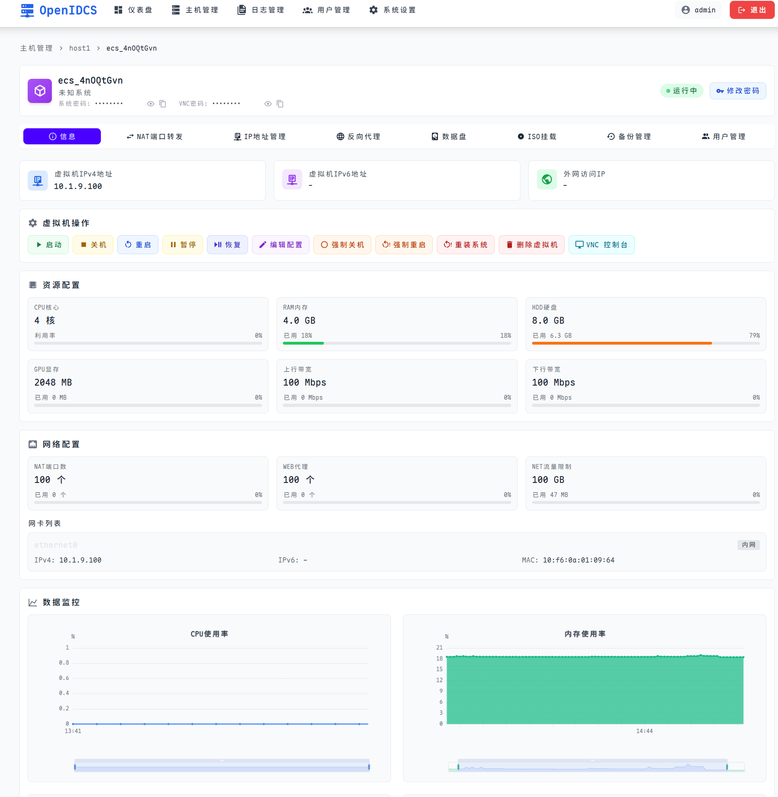
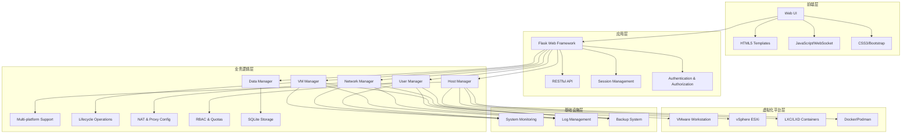

# OpenIDC-Client 开源IDC虚拟化统一管理平台

<p align="center">
  <strong>使用统一Web界面和RESTful API来管理多虚拟化平台的虚拟机基础设施</strong><br>
  <em>支持VMware、LXC、Docker等多种虚拟化技术，提供企业级虚拟机生命周期管理</em>
</p>

<p align="center">
  <a href="https://github.com/OpenIDCSTeam/OpenIDCS-Client"></a>
  <a href="https://github.com/OpenIDCSTeam/OpenIDCS-Client"></a>
  <a href="https://github.com/OpenIDCSTeam/OpenIDCS-Client/issues"></a>
  <a href="https://github.com/OpenIDCSTeam/OpenIDCS-Client/blob/main/LICENSE"></a>
</p>

<p align="center"><a href="ProjectDoc/APIDOC_ALL.md">📚 API文档</a> | <a href="ProjectDoc/DEPLOYMENT.md">🚀 部署指南</a> | <a href="ProjectDoc/PROJECT_OVERVIEW.md">🏗️ 项目架构</a></p>



---

## 🎯 项目概述

OpenIDC-Client是一个开源的IDC（Internet Data Center）虚拟化统一管理平台，旨在简化多虚拟化环境下的虚拟机管理工作。它提供了一个统一的Web管理界面和完整的RESTful API，让运维人员可以轻松地管理分布在多个虚拟化平台上的虚拟机集群。

### 🌟 核心特性

- **🔧 多虚拟化平台支持**

| 平台                 | 状态    | 受控端支持的操作系统            | 架构            |
|--------------------|-------|-----------------------|---------------|
| LXC/D Environments | ✅ 已实现 | Windows, Linux        | x86_64, ARM64 |
| Docker/Podman/K8SC | ✅ 已实现 | Windows, Linux, macOS | x86_64, ARM64 |
| VMware Workstation | ✅ 已实现 | Windows               | x86_64        |
| Proxmox VE Runtime | ✅ 已实现 | Windows, Linux        | x86_64, ARM64 |
| VMware vSphere ESX | ✅ 已实现 | Windows, Linux, macOS | x86_64, ARM64 |
| Windows Hypervisor | 🚧️ 实施中 | Windows               | x86_64        |
| Oracle Virtual Box | ❌ 计划中 | Windows, Linux        | x86_64, ARM64 |
| QEMU & KVM Machine | ❌ 计划中 | Windows, Linux, macOS | x86_64, ARM64 |
| MEmu Game Emulator | ❌ 计划中 | Windows               | x86_64        |

- **🖥️ 完整的虚拟机生命周期管理**
  - 创建、配置、启动、停止、重启、删除虚拟机
  - 实时状态监控和硬件资源使用情况跟踪
  - 虚拟机快照备份与一键还原
  - 动态资源调整（CPU、内存、存储）

- **🌐 网络与安全管理**
  - 智能IP地址分配与管理
  - NAT端口转发配置
  - Web反向代理设置
  - 防火墙规则管理（iptables）
  - SSH终端直连

- **👥 多租户用户管理**
  - 基于角色的访问控制（RBAC）
  - 细粒度权限管理（创建/修改/删除虚拟机权限）
  - 资源配额限制（CPU、内存、存储、网络、流量）
  - 用户资源使用统计和限制

- **📊 监控与运维**
  - 实时主机和虚拟机性能监控
  - 系统资源使用情况可视化
  - 完整的操作日志记录
  - 定时任务调度和执行

- **🔌 远程访问**
  - 基于Web的VNC控制台访问
  - 无需安装客户端的远程桌面体验
  - SSL加密的安全连接

- **💾 存储管理**
  - 虚拟磁盘挂载/卸载
  - ISO镜像管理
  - 数据备份与迁移

---

## 🏗️ 技术架构

### 系统架构图



### 技术栈

| 层级 | 技术组件 | 版本要求 |
|------|----------|----------|
| **前端** | HTML5/CSS3/jQuery/Bootstrap | - |
| **后端** | Python Flask | >= 2.0.0 |
| **数据库** | SQLite | - |
| **日志** | Loguru | >= 0.6.0 |
| **HTTP客户端** | Requests | >= 2.28.0 |
| **系统监控** | psutil/GPUtil | >= 5.9.0/1.4.0 |
| **压缩工具** | py7zr | >= 0.20.0 |
| **虚拟化** | pyvmomi/pylxd/docker | 可选依赖 |
| **打包** | Nuitka/cx_Freeze | >= 1.8.0 |

---

## 🚀 快速开始

### 环境要求

- **操作系统**: Windows 10/11, Linux (Ubuntu 18.04+, CentOS 7+), macOS 10.14+
- **Python**: 3.8 或更高版本
- **内存**: 最少 4GB RAM（推荐 8GB+）
- **存储**: 最少 2GB 可用空间
- **网络**: 能够访问虚拟化平台的管理接口

### 5分钟快速部署

#### 1. 克隆项目
```bash
# 下载项目源码
git clone https://github.com/OpenIDCSTeam/OpenIDCS-Client.git
cd OpenIDCS-Client
```

#### 2. 安装依赖
```bash
# 安装Python依赖
pip install -r HostConfig/requirements.txt
```

#### 3. 启动服务
```bash
# 开发模式启动
python HostServer.py

# 或使用生产模式（推荐）
python HostServer.py --production
```

#### 4. 访问管理界面
- 打开浏览器访问: http://localhost:1880
- 首次启动会自动生成访问Token，请查看控制台输出
- 使用Token登录或创建管理员账户

### 首次配置

1. **登录系统**: 使用控制台显示的Token登录
2. **添加虚拟化主机**: 进入"主机管理"添加VMware Workstation等主机
3. **配置网络**: 设置IP地址池和NAT规则
4. **创建用户**: 为团队成员创建账户并分配权限
5. **开始管理**: 创建和管理您的虚拟机

---

## 📖 使用场景

### 适用场景

- **🏢 中小企业IT部门**: 统一管理公司内的开发、测试、生产环境虚拟机
- **☁️ 私有云运维**: 作为私有云平台的轻量级管理前端
- **🎓 教育培训机构**: 为实验室或培训中心提供虚拟机资源共享平台
- **🔬 研发团队**: 管理开发测试环境的虚拟机集群
- **🏭 传统IDC转型**: 帮助传统IDC服务商提供虚拟化服务

### 典型工作流程

1. **环境准备**: 部署OpenIDC-Client并配置虚拟化主机
2. **用户管理**: 创建团队账户并设置资源配额
3. **模板管理**: 准备标准化的虚拟机模板
4. **自助服务**: 用户通过Web界面自助申请和管理虚拟机
5. **监控运维**: 通过仪表盘监控资源使用情况和系统健康状态

---

## 🛠️ 开发与贡献

### 开发环境搭建

```bash
# 克隆项目
git clone https://github.com/OpenIDCSTeam/OpenIDCS-Client.git
cd OpenIDCS-Client

# 创建虚拟环境（推荐）
python -m venv venv
source venv/bin/activate  # Linux/Mac
venv\Scripts\activate     # Windows

# 安装开发依赖
pip install -r HostConfig/requirements.txt
pip install pytest pytest-flask black flake8

# 启动开发服务器
python HostServer.py
```

### 项目结构

```
OpenIDC-Client/
├── 📁 HostServer/          # 核心服务器代码
│   ├── BasicServer.py      # 基础服务器类
│   ├── OCInterface.py      # VMware Workstation接口
│   ├── vSphereESXi.py      # vSphere ESXi接口
│   └── Workstation.py      # 工作站管理
├── 📁 HostModule/          # 功能模块
│   ├── HostManager.py      # 主机管理
│   ├── RestManager.py      # REST API管理
│   ├── UserManager.py      # 用户管理
│   └── DataManager.py      # 数据持久化
├── 📁 WebDesigns/          # Web界面模板
│   ├── dashboard.html      # 仪表盘
│   ├── hosts.html          # 主机管理
│   ├── vms.html            # 虚拟机管理
│   └── vm_detail.html      # 虚拟机详情
├── 📁 HostConfig/          # 配置文件
│   ├── requirements.txt    # Python依赖
│   ├── envinstall-*.sh     # 环境安装脚本
│   └── pipinstall-*.txt    # 平台特定依赖
├── 📁 ProjectDoc/          # 项目文档
│   ├── APIDOC_ALL.md       # API文档
│   ├── DEPLOYMENT.md       # 部署指南
│   └── PROJECT_OVERVIEW.md # 项目概览
├── 📁 AllBuilder/          # 构建脚本
│   ├── build_nuitkaui.*    # Nuitka打包
│   └── build_cxfreeze.*    # cx_Freeze打包
└── 📄 HostServer.py        # 主程序入口
```

### 贡献指南

我们欢迎各种形式的贡献！

1. **提交Issue**: 报告Bug或提出建议
2. **Pull Request**: 提交代码改进
3. **文档完善**: 帮助改进项目文档
4. **测试反馈**: 在不同环境下测试并提供反馈

请确保遵循项目的代码规范和提交规范。

---

## 📦 构建与分发

### 使用Nuitka打包（推荐）

Nuitka可以将Python项目编译成独立的可执行文件，性能更好，体积更小。

**Windows 用户**：
```batch
cd AllBuilder
build_nuitka.bat
```

**Linux/Mac 用户**：
```bash
cd AllBuilder
chmod +x build_nuitkaui.sh
./build_nuitkaui.sh
```

### 使用cx_Freeze打包

```bash
python HostBuilds.py build
```

详细打包说明请查看 [构建文档](AllBuilder/README.md)。

---

## 📋 配置说明

- **数据存储**: 主机配置和用户信息保存在 `DataSaving/` 目录
- **日志文件**: 按主机名分别保存在 `DataSaving/` 目录
- **虚拟机文件**: 存储路径在主机配置中指定
- **Web界面**: 使用Flask模板系统，支持自定义主题
- **API认证**: 支持Token和Session双重认证机制

---

## 🙏 致谢与参考

- 受控端Web和魔方对接插件风格与部分代码基于：『魔方财务-LXD对接服务器』项目
- 原作者: xkatld
- 原项目地址: https://github.com/xkatld/zjmf-lxd-server
- 感谢所有为开源社区做出贡献的开发者们

---

## 📄 许可证

本项目采用 MIT 许可证 - 查看 [LICENSE](LICENSE) 文件了解详情。

---

## 📞 联系我们

- **项目主页**: https://github.com/OpenIDCSTeam/OpenIDCS-Client
- **问题反馈**: https://github.com/OpenIDCSTeam/OpenIDCS-Client/issues
- **讨论交流**: https://gitter.im/OpenIDCSTeam/community
- **邮箱联系**: openidcs@team.org

---

<div align="center">
  <strong>⭐ 如果这个项目对您有帮助，请给我们一个Star！</strong>
</div>